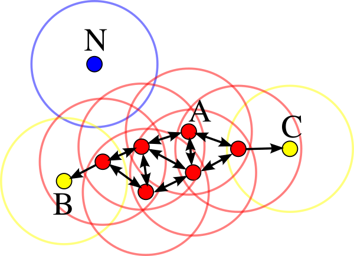
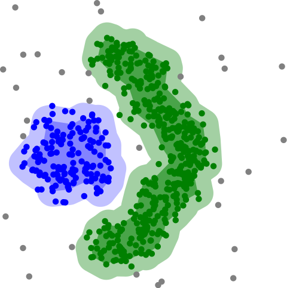
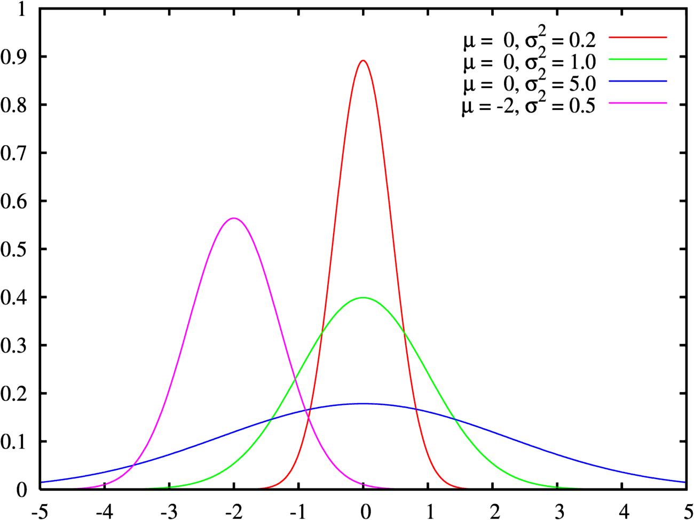

## Clustering

Clustering (also called *cluster analysis*) is a task of grouping similar instances into clusters. More formally, clustering is the task of grouping the population of **unlabeled data points** into clusters in a way that data points in the same cluster are more similar to each other than to data points in other clusters.

The clustering task is probably the most important in unsupervised learning, since it has many applications, for example:
- *data analysis*:  often a huge dataset contains several large clusters, analyzing which separately, you can come to good results;
- *anomaly detection*: as we saw before, data points located in the regions of low density can be considered as anomalies;
- *semi-supervised learning*: clustering approaches often helps you to automatically label data for classification tasks;
- *indirectly clustering* tasks: recommender systems, search engines, etc., and
- *directly clustering* tasks: customer segmentation, image segmentation, etc.

|  |
|:--:|
| <b>Clustering algorithms by Scikit Learn. [Image source](https://scikit-learn.org/0.15/auto_examples/cluster/plot_cluster_comparison.html)</b>|

All clustering algorithms **requires data preprocessing and standardization**. Most clustering algorithms perform worse with a large number of features, so it is sometimes recommended to use methods of *dimensionality reduction* before clustering.

### K-Means

K-Means algorithm is based on the *centroid* concept. *Centroid* is a geometric center of a cluster (mean of coordinates of all cluster points). First, centroids are initialized randomly (this is the basic option, but there are other initialization techniques). After that, we iteratively do the two following steps, while centroids are moving:
- Update the clusters - for each data point assign it a cluster number with the nearest centroid, and
- Update the clusters centroids - calculate the new mean value of the cluster elements to move centroids.

|  |
|:--:|
| <b>Convergence of K-Means algorithm. [Public domain](https://en.wikipedia.org/wiki/K-means_clustering#/media/File:K-means_convergence.gif)</b>|

The strengths and weaknesses of the algorithm are intuitive. It is simple and fast, but it requires initial knowledge about the number of clusters. It also does not detect clusters of all shapes well, and can result in a local solution. To choose a good number of clusters we can use *sum of squared distances from data points to cluster centroids* as a metric and choose the number when this metric stops falling fast. To find a globally optimal solution, you can run the algorithm several times and choose the best result (`n_init` parameter in *sklearn*).

A speeded version of this algorithm is **Mini Batch K-Means**. In that case, we use a random subsample of the dataset instead of the whole dataset for calculations. There are a lot of other modifications, and many of them are implemented in *sklearn*.

**Pros**:
+ Simple and intuitive;
+ Scales to large datasets;
+ As a result, we also have centroids that can be used as standard cluster representatives.
 
**Cons**:
- Knowledge about the number of clusters is necessary and must be specified as a parameter;
- Does not cope well with a very large number of features;
- Separates only convex and homogeneous clusters well;
- Can result in poor local solutions, so it needs to be run several times, choosing only the best solution.

### Hierarchical Clustering

Hierarchical clustering (also **Hierarchical Cluster Analysis (HCA)** or **Agglomerative Clustering**) is a family of clustering algorithms that build a hierarchy of clusters during the analysis. 

It is represented as a dendrogram (a tree diagram). The *root* of the tree (usually the upper or left element) is the only cluster that contains all data points. The *leaves* (bottom or right elements) are clusters, each of which contains only one data point. According to the generated dendrogram, you can choose the desired separation into any number of clusters.

|  |
|:--:|
| <b>Hierarchical Clustering dendrogram example. Adapted from a [public domain](https://commons.wikimedia.org/wiki/File:Iris_dendrogram.png)</b>|

This family of algorithms requires calculating the distance between clusters. Different metrics are used for this purpose (simple linkage, complete linkage, average linkage, centroid linkage, etc.), but one of the most effective and popular is **Ward's distance** or Ward's linkage.

To learn more about the different methods of measuring the distance between clusters, start with this article:

https://dataaspirant.com/hierarchical-clustering-algorithm/#:~:text=creates%20meaningful%20clusters.-,Difference%20ways%20to%20measure%20the%20distance%20between%20two%20clusters,-There%20are%20several

**Pros**:
+ Simple and intuitive;
+ Works well when data has a hierarchical structure.
  
**Cons**:
- Knowledge about the number of clusters is necessary and must be specified as a parameter;
- Separates only convex and homogeneous clusters well;
- Greedy algorithm, so can result in poor local solutions.

### Spectral Clustering

Spectral clustering approach is based on graph theory and linear algebra. This algorithm uses the *spectrum* (set of *eigenvalues*) of the *similarity matrix* (that contain a similarity of each pair of data points) to perform dimensionality reduction. Then it uses some of the clustering algorithms in this low-dimensional space (`sklearn.cluster.SpectralClustering` class uses K-Means).

Due to the dimensionality reduction, this algorithm can detect complex cluster structures and shapes. It can also be used to search for clusters in graphs. However, due to its computational complexity, it does not work well with large datasets.

Pros:
+ Can detect complex cluster structures and shapes;
+ Can be used to search for clusters in graphs.
  
Cons:
- Knowledge about the number of clusters is necessary and must be specified as a parameter;
- Does not cope well with a very large number of instances;
- Does not cope well when the clusters have very different sizes.

### DBSCAN

The DBSCAN abbreviation stands for *Density-Based Spatial Clustering of Applications with Noise*.

According to this algorithm, clusters are high-density regions (where the data points are located close to each other) separated by low-density regions (where the data points are located far from each other).

The central concept of the DBSCAN algorithm is the idea of a *core sample*, which means a sample located in an area of high density. The data point is considered a core sample if at least `min_samples` other instances (usually including the starting point) are located within `eps` distance from this point.

|  |
|:--:|
| <b>DBSCAN core samples example. min_samples=4, core samples marked in red. [Public domain](https://en.wikipedia.org/wiki/File:DBSCAN-Illustration.svg)</b>|

Therefore, a cluster is a group of core samples located close to each other and some non-core samples located close to core samples. Other samples are defined as outliers (or anomalies) and do not belong to any cluster. This approach is called **density-based clustering**. It allows you not to specify the number of clusters as a parameter and find clusters of complex shapes.

|  |
|:--:|
| <b>DBSCAN clustering. [Public domain](https://commons.wikimedia.org/wiki/File:DBSCAN-density-data.svg)</b>|

An extension or generalization of the DBSCAN algorithm is the **OPTICS** algorithm (*Ordering Points To Identify the Clustering Structure*).

**Pros**:
+ Knowledge about the number of clusters is not necessary;
+ Also solves the anomaly detection task.
 
**Cons**:
- Need to select and tune the density parameter (`eps`);
- Does not cope well with sparse data.

### Affinity Propagation

The Affinity Propagation algortihm also does not require knowledge about the number of clusters. But unlike DBSCAN, which is a *density-based* clustering algorithm, affinity propagation is based on the idea of *passing messeges between data points*. Calculating pairwise similarity based on some distance function (i.e. *Euclidean distance*) this algorithm then converges in some number of *standard representatives*. A dataset is then described using this small number of *standard representatives*, which are identified as the most representative instances in comparison with other samples. 

|  |
|:--:|
| <b>Affinity Propagation clustering by Scikit Learn. [Image source](https://scikit-learn.org/stable/auto_examples/cluster/plot_affinity_propagation.html)</b>|

The results of this algorithm often leave much to be desired, but it has a number of strong advantages. However, its main disadvantage, the computational complexity (caused by the need to calculate the distance for *all possible pairs of data points*) does not allow it to be used on large datasets.

**Pros**:
+ Knowledge about the number of clusters is not necessary;
+ As a result, we also have standard representatives of a cluster. Unlike K-Means, these instances are not just average values, but real objects from the dataset.
 
**Cons**:
- Works much slower than other algorithms due to computational complexity;
- Does not cope well with a large number of instances;
- Separates only convex and homogeneous clusters well.

### Mean Shift

// This algorithm starts by placing a circle centered on each instance, then for each circle it computes the mean of all the instances located within it, and it shifts the circle so that it is centered on the mean. Next, it iterates this mean-shifting step until all the circles stop moving.

// Mean Shift shifts the circles in the direction of higher density, until each of them has found a local density minimum. Finally, all the instances whose circles have settled in the same place (or close enough) are assigned to the same cluster. Mean Shift has some of the features of DBSCAN, because it's based on density too.

**Pros**:
+ Knowledge about the number of clusters is not necessary;
+ Have just one hyperparameter - the radius of the circles, called *bandwidth*.
 
**Cons**:
- Does not cope well with a sparse data;
- Does not cope well with a very large number of instances;
- // Tends to chop clusters into pieces when they have internal density variations

### BIRCH

The BIRCH stands for *Balanced Iterative Reducing and Clustering using Hierarchies*. 

This hierarchical clustering algorithm was designed specifically for large datasets. In the majority of cases, it requires only one scan of the dataset. 

During training, it creates a dendrogram containing enough information to quickly assign each new data instance to some cluster without having to store all instances in memory. These principles allow getting the best quality for a given set of memory and time resources compared with other clustering algorithms. They also allow to incrementally cluster incoming data instances performing *online learning*.

**Pros**:
+ Was designed specifically for very large datasets;
+ Show the best quality for a given set of memory and time resources;
+ Allows implementing online clustering.

**Cons**:
- Does not cope well with a very large number of features.

### Gaussian Mixture Models

Gaussian Mixture Models (*GMM*) is a probabilistic algorithm that can solve all three main unsupervised learning tasks: *clustering*, *density estimation*, and *anomaly detection*.

This method is based on the *Expectation Maximization* algorithm and assumes that data points were generated from a group (*mixture*) of Gaussian distributions. This algorithm can result in poor local solutions, so it needs to be run several times, keeping only the best solution (`n_init` parameter in *sklearn*).

It is known that in the general case the Gaussian distribution has two parameters: a vector of *mean* (μ) and a matrix of *variance* (σ^2). Then, if it is known that the data can be divided into `N` clusters in `M`-dimensional space, the task of the algorithm is to select `N` μ vectors (with `M` elements) and `N` σ^2 matrices (with `MxM` elements). In the case of one-dimensional space, both μ and σ^2 are scalars (single numbers).

|  |
|:--:|
| <b>Guassian (normal) distribution with different parameters. [Public domain](https://commons.wikimedia.org/wiki/File:Normal_distribution_pdf.png)</b>|

In the image below you can see two distributions in two-dimensional space. Each of the distributions has the following parameters:
- two values for the mean vectors (x and y coordinates);
- four values for the variance matrices (variances in main diagonal and covariances in the other elements).

|  |
|:--:|
| <b>GMM example by Scikit Learn. [Image source](https://scikit-learn.org/stable/auto_examples/mixture/plot_gmm_pdf.html)</b>|

To choose a good number of clusters you can use *BIC* or *AIC* (Bayesian / Akaike information criterion) as metrics and choose the model with its minimum value. On the other hand, you can use the **Bayesian GMM** algorithm. This model only requires a value that is greater than the possible number of clusters and can detect the optimal number itself.

Also, the Gaussian Mixture Model is a *generative model*, meaning that you can sample new instances from it. It is also possible to estimate the density of the model at any given location.

Pros:
+ Perfectly deals with datasets that were generated from a mixture of Gaussian distributions with different shapes and sizes;
+ At the same time solves *density estimation* task;
+ Is a *generative model*, so can generate new instances.
 
Cons:
- Knowledge about the number of clusters is necessary and must be specified as a parameter (not in the case of *Bayesian GMM*);
- *Expectation Maximization* algorithm can result in poor local solutions, so it needs to be run several times, keeping only the best solution 
- Does not scale well with large numbers of features;
- Assume that data instances were generated from a mixture of Gaussian distributions, so cope badly with data of other shapes.

### How to choose a clustering algorithm?

As you can see, the clustering task is quite difficult and have a wide variety of applications, so it's almost impossible to build some universal set of rules to select a clustering algorithm - all of them have advantages and disadvantages.

Things become better when you have some assumptions about your data, so *data analysis* can help you with that. What is the approximate number of clusters? Are they located far from each other or do they intersect? Are they similar in shape and density? All that information can help you to solve your task better.

If the number of clusters is unknown, a good initial approximation is *the square root of the number of objects*. You can also first run an algorithm that does not require a number of clusters as a parameter (*DBSCAN* or *Affinity Propagation*) and use the resulting value as a starting point.

Another important question remains the evaluation of quality - you can try all the algorithms, but how to understand which one is the best? There are a great many metrics for this - from *homogeneity* and *completeness* to *silhouette* - they show themselves differently in different tasks. Understanding these metrics and how to use them successfully comes with experience and goes beyond the scope of this article.

