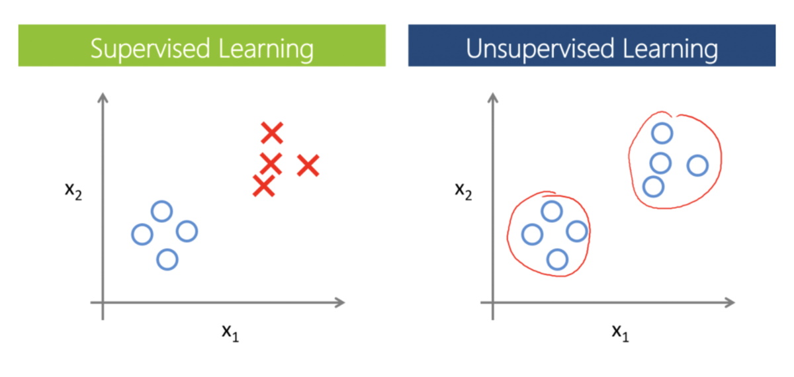

## Introduction

*Unsupervised learning* is a machine learning technique in which developers don't need to supervise the model. Instead, it allows the model to work on its own to discover patterns and information that was previously undetected. It mainly deals with the unlabeled data, while supervised learning, as we remember, deals with labeled data.

|  |
|:--:|
| <b>Supervised vs Unsupervised Learning. [Public Domain](https://commons.wikimedia.org/wiki/File:Machin_learning.png)</b>|

The most popular unsupervised learning tasks are:
- **Dimensionality Reduction** - task of reducing the number of input features in a dataset,
- **Anomaly Detection** - the task of detecting instances that are very different from the norm,
- **Clustering** - task of grouping similar instances into clusters.

The *Clustering* task is probably the most important in unsupervised learning, since it has many applications. At the same time *Dimensionality Reduction* and *Anomaly Detection* tasks can be attributed to auxiliary ones (they are often interpreted as *data cleaning* or *feature engineering* tools). Despite the fact that these tasks are definitely important, some people often do not distinguish them separately when studying unsupervised learning, leaving only the clustering task.   

Algorithms for solving these tasks and that we will mention in this article are:
- *Dimensionality Reduction*:
  - *Principal Component Analysis*
  - *Manifold Learning* - *LLE*, *Isomap*, *t-SNE*
  - *Autoencoders* and others
- *Anomaly Detection*:
  - *Isolation Forest*
  - *Local Outlier Factor*
  - *Minimum Covariance Determinant* and other algorithms from dimensionality reduction or supervised learning
- *Clustering*:
  - *K-Means*
  - *Hierarchical Clustering* and *Spectral Clustering*
  - *Gaussian Mixture Models*
  - *DBSCAN*, *BIRCH* and others
