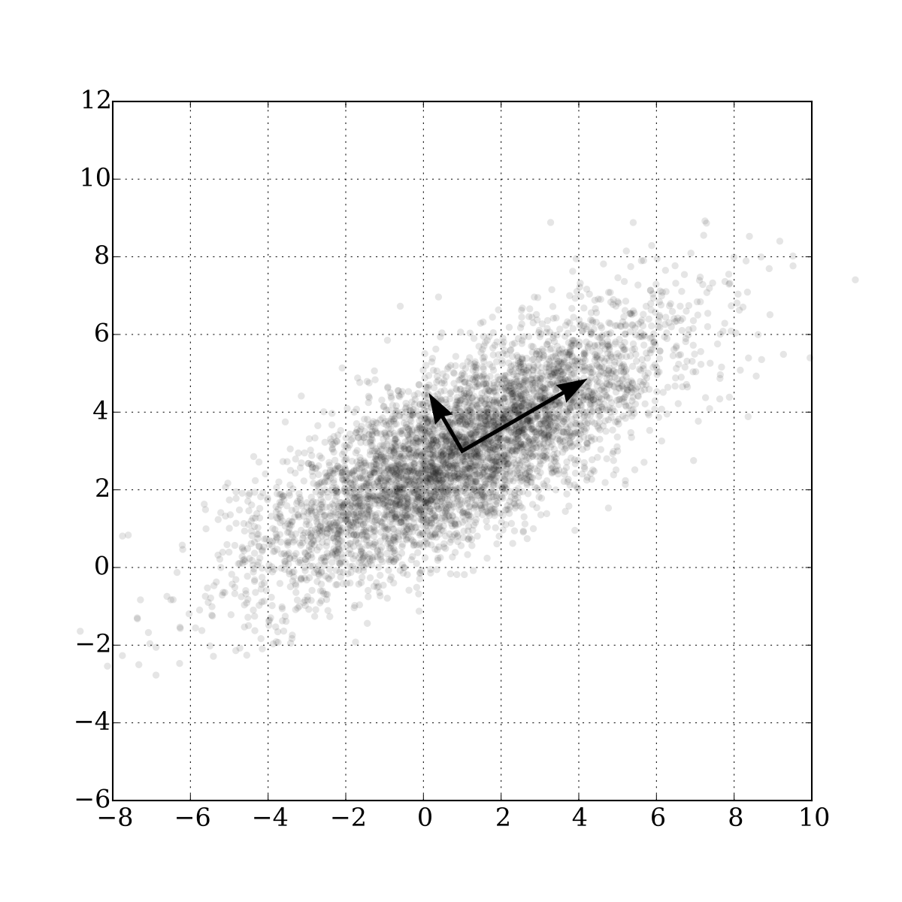
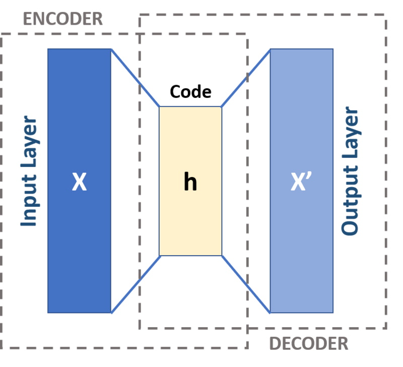

## Dimensionality Reduction

Dimensionality reduction algorithms represent techniques that *reduce the number of features* (not samples) in a dataset. 

In the example below the task is to reduce the number of input features (unroll swissroll from 3D to 2D) and save the largest ratio of information at the same time. This is the essence of the dimensionality reduction task and these algorithms.

|  |
|:--:|
| <b>Dimensionality Reduction Example. [Public Domain](https://commons.wikimedia.org/wiki/File:Lle_hlle_swissroll.png)</b>|

Two main applications of dimensionality reduction algorithms are:
- **Data Visualization** & **Data Analysis** - reduce the number of input features to three or two and use data visualization techniques to get insights about the data
- **Preparatory tool for other machine learning algorithms**. More input features often make a prediction task more challenging to model, what is known as the **Curse of Dimensionality**. Since many algorithms (both from supervised and unsupervised learning (e.g. regression/classification, clustering)) do not work well with sparse or high-dimensional data, dimensionality reduction algorithms can greatly increase the quality. Often, this also provides faster and simpler calculations.

Methods are commonly divided into:
- **Feature Selection** - find a subset of the input features
- **Feature Projection** (or *Feature Extraction*) - find the optimal projection of the original data into some low-dimensional space 

Next, we will talk about the second group of methods. Check *feature engineering* for more *feature selection* tools, e.g. LASSO regression, correlation analysis, etc. In fact, the following algorithms can also be used as *feature selection* tools with the difference that these will no longer be the original features, but some of their modifications (for example linear combinations in case of *PCA*).

### Principal Component Analysis

To reduce the dimensionality, Principal Component Analysis (*PCA*) uses the projection of the original data into the *principal components*. 
The principal components are orthogonal vectors that describe the maximum amount of *residual variation* (they are found using *Singular Value Decomposition*).

|  |
|:--:|
| <b>PCA of a Gaussian distribution with two principal components. [Public Domain](https://en.wikipedia.org/wiki/Principal_component_analysis#/media/File:GaussianScatterPCA.svg)</b>|

Thus, by choosing the first `N` principal components (where `N < M, M is the number of features`), we move from the M-dimensional space to the N-dimensional space, where new features are linear combinations of the existing features. 

To select the number of components, the so-called *elbow method* is used. Plot a graph of the cumulative sum of the explained variance and then select the number of components that explains the desired ratio of information (usually 80% or 95%).

PCA requires data scaling and centering (`sklearn.decomposition.PCA` class does it automatically).

There are a lot of popular modifications of these algorithms, but the most popular are:
- *Incremental PCA* - for *online learning* or when data doesn't fit in memory
- *Randomized PCA* - stochastic algorithm that allows to quickly estimate the first N components
- *Kernel PCA* - *kernel trick* allows performing complex nonlinear projections

### Manifold Learning

Manifold Learning algorithms are based on some distance measure conservation.
These algorithms are reducing the dimensionality *while saving distances between objects*.

|  |
|:--:|
| <b>Comparison of Manifold Learning methods by Scikit Learn. [Image Source](https://scikit-learn.org/stable/auto_examples/manifold/plot_compare_methods.html)</b>|

- **LLE**
  
  LLE (*Locally Linear Embedding*) studies the linear connections between data points in the original space, and then tries to move to a smaller dimensional space, while preserving within local neighborhoods.
  There are a lot of modifications of this algorithm, like *Modified Locally Linear Embedding (MLLE)*, *Hessian-based LLE (HLLE)*, and others.

- **Isomap**
  
  Isomap (short for *Isometric Mapping*) сreates a graph by connecting each instance to its nearest neighbors, and then reduces dimensionality while trying to preserve the *geodesic distances* (distance between two vertices in a graph) between the instances.

- **t-SNE**
  
  t-SNE stands for *t-distributed Stochastic Neighbor Embedding*.
  Reduces dimensionality by saving the relative distance between points in space - so it keeps similar instances close to each other and dissimilar instances apart. Most often used for data visualization.

### Autoencoders

We can use neural networks to do dimensionality reduction too. Autoencoder is a network that tries to output values that are as similar as possible to the inputs when the network structure implies *a bottleneck* - a layer where the number of neurons is much fewer than in the input layer.

|  |
|:--:|
| <b>Autoencoder Structure. [Public Domain](https://en.wikipedia.org/wiki/Autoencoder#/media/File:Autoencoder_schema.png)</b>|

If we use a linear activation function, we will get linear dimensionality reduction rules, like *PCA*. But if we use nonlinear activation functions, we can get more complex latent representations. 
Unfortunately, we have to have a lot of data. Fortunately, this data is unlabeled, so it's usually easy to collect.

As for other algorithms, there are a lot of different variations, like:
- *Denoising Autoencoders* that can help clean up the images or sound
- *Variational Autoencoders* that deal with distributions instead of specific values 
- *Convolutional Autoencoders* for images
- *Recurrent Autoencoders* for time series or text

### How to choose a dimensionality reduction algorithm?

First of all, make sure you scaled the data. Almost all dimensionality reduction algorithms require that.

If you reduce dimensionality for *data visualization*, you should try **t-SNE** first.

If you have a lot of data, **autoencoders** can help you to find very complex latent representations. 

If you don't have a lot of data, try **PCA for linear** dimensionality reduction and **manifold learning algorithms** (*LLE*, *Isomap* and others) **for non-linear dimensionality reduction**. 

|  |
|:--:|
| <b>Dimensionality Reduction Algorithm Selection. Image by Author</b>|

Note, that almost every algorithm has many variations, and there are a lot of other less popular algorithms, like:
- *Non-negative matrix factorization (NMF)*
- *Random Projections*
- *Linear Discriminant Analysis (LDA)*
- *Multidimensional Scaling (MDS)*
- and others

