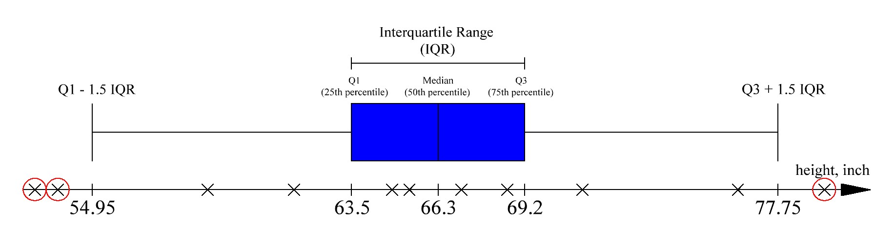
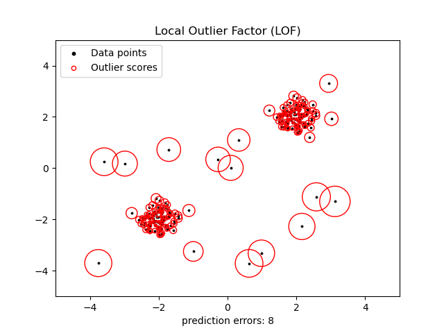
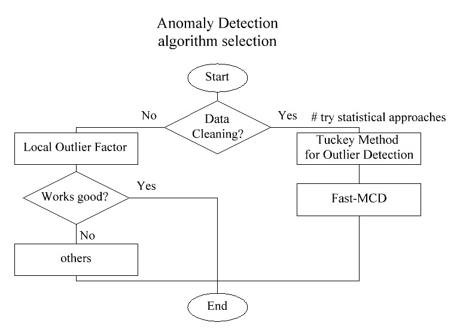

## Anomaly Detection

Anomaly detection (also **outlier detection**) is the task of detecting abnormal instances - instances that are very different from the norm. These instances are called *anomalies*, or *outliers*, while normal instances are called *inliers*.

|  |
|:--:|
| <b>Anomaly Detection Algorithms by Scikit Learn. [Image Source](https://scikit-learn.org/stable/auto_examples/miscellaneous/plot_anomaly_comparison.html)</b>|

Anomaly detection is useful in a wide variety of applications, the most important are: 
- *data cleaning* - removing outliers from a dataset before training another model
- directly *anomaly detection* tasks: fraud detection, detecting defective products in manufacturing etc.

As you may have noticed, some problems of *unbalanced classification* can be also solved using anomaly detection algorithms. But you need to understand the difference - these are *two completely different approaches*.

In the case of **classification, we want to understand what anomalies (positive examples) look like** to detect similar instances in the future.
In the case of **anomaly detection, future anomalies may look completely different from any examples we have seen before**. Because our dataset is unlabeled, we can only suspect how normal data points look and consider any other instances as anomalies.

For example, an email spam detection task can be considered as a classification task (when we have enough spam to understand what spam emails should look like) and also as an anomaly detection task (when we have to understand how normal emails look like and consider any other emails as spam).

A closely related task is **Novelty Detection**, but in this case, the algorithm is assumed to be trained on a clean dataset (without outliers). It is widely used in *online learning* when it is necessary to identify whether a new instance is an outlier or not.

Another related task is **Density Estimation**. It is a task of estimating the *probability density function* of the process that the dataset generates. It is usually solved with clustering algorithms, based on the *density* concept (*Gaussian Mixture Models* or *DBSCAN*) and can also help for anomaly detection and data analysis.

### Statistical Approaches

The easiest way to detect outliers is to try statistical methods, that were developed a very long time ago. One of the most popular of them is called **Tukey Method for Outlier Detection** (or **Interquartile Range (IQR)**). 

Its essence is to calculate percentiles and the interquartile range. Data points located before `Q1 - 1.5*IQR` and after `Q3 + 1.5*IQR` are considered outliers. Below you can see an illustration of this method using the [people height dataset](https://www.kaggle.com/mustafaali96/weight-height) example. Heights below 54.95 inches (139 cm) and above 77.75 inches (197 cm) are considered outliers.

|  |
|:--:|
| <b>Tukey Method for Outlier Detection on the example of the heights of people. Image by Author</b>|

This and other statistical approaches (*z-score method for detecting outliers*, etc.) are often used for data cleaning.

### Clustering and dimensionality reduction algorithms

Another simple, intuitive and often effective approach to anomaly detection is to solve density estimation task with some clustering algorithms, like *Gaussian Mixture Models* and *DBSCAN*. Then, any instance located in regions with a lower density level can be considered an anomaly, we just need to set some density threshold.

Also, any dimensionality reduction algorithm that has the `inverse_transform()` method can be used. This is because the *reconstruction error* of an anomaly is always much larger than the one of a normal instance.

### Isolation Forest and SVM

Some supervised learning algorithms also can be used for anomaly detection, and two of the most popular are *Isolation Forest* and *SVM*. These algorithms are better suited for novelty detection but usually work well for anomaly detection too.

**Isolation Forest** algorithm builds a *Random Forest* in which each decision tree is grown randomly. With each step, this forest isolates more and more points until all they become isolated. Since the anomalies are located further from the usual data points, they are usually isolated in fewer steps than normal instances. This algorithm performs well for high-dimensional data, but requires a larger dataset than SVM.

**SVM** (in our case *one-class SVM*) is also widely used for anomaly detection. Thanks to *kernel trick* kernelized SVM can build an effective "limiting hyperplane", which will separate the normal points from the outliers. Like any SVM modification, it copes great with high-dimensional or sparse data, but works well only on small and medium-sized datasets.

### Local Outlier Factor

Local Outlier Factor (*LOF*) algorithm is based on the assumption that the anomalies are located in lower-density regions. However, instead of just setting a density threshold (as we can do with *DBSCAN*), it compares the density of a certain point with the density of k its nearest neighbors. If this certain point has a much lower density than its neighbors (that means that it is located far away from them), it is considered an anomaly.

This algorithm can be both used for anomaly and novelty detection. It is used very often because of its computational simplicity and good quality.

|  |
|:--:|
| <b>Local Outlier Factor by Scikit Learn. [Image Source](https://scikit-learn.org/stable/auto_examples/neighbors/plot_lof_outlier_detection.html)</b>|

### Minimum Covariance Determinant

Minimum Covariance Determinant (*MCD* or its modification *Fast-MCD*) is useful for outlier detection, in particular for data cleaning. It assumes that inliers are generated from a single Gaussian distribution, and outliers were not generated from this distribution. Since many data have a normal distribution (or can be reduced to it), this algorithm usually performs well. It is implemented in the `EllipticEnvelope` *sklearn* class.

### How to choose an anomaly detection algorithm?

If you need to clean up the dataset, you should first try classic statistical methods like **Tukey Method for Outlier Detection**. Then go with **Fast-MCD**, if you know that your data distribution is Gaussian.

If you do anomaly detection not for data cleaning, first of all, try simple and fast **Local Outlier Factor**. If it doesn't work well (or if you need separating hyperplane for some reason) - try other algorithms according to your task and dataset:
- **One-class SVM** for sparse high-dimensional data or **Isolation Forest** for dense high-dimensional data
- **Gaussian Mixture Models** if you can assume that data were generated from a mixture of several Gaussian distributions
- and so on.

|  |
|:--:|
| <b>Anomaly Detection Algorithm Selection. Image by Author</b>|