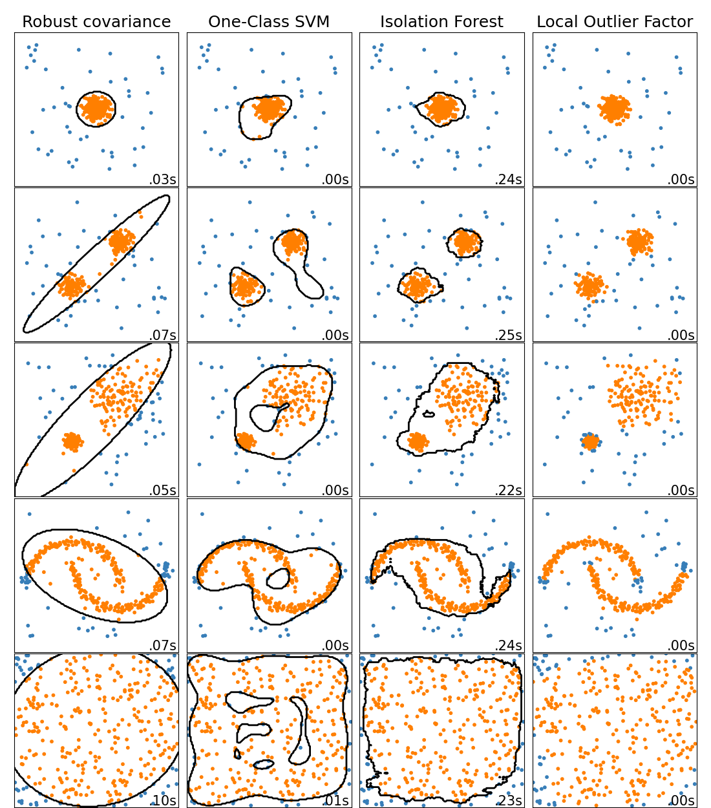

## Anomaly Detection

Anomaly detection (also called **outlier detection**) is the task of detecting instances that are very different from the norm. These instances are called *anomalies*, or *outliers*, while the normal instances are called *inliers*.

|  |
|:--:|
| <b>Anomaly Detection Algorithms by Scikit Learn. [Image Source](https://scikit-learn.org/stable/auto_examples/miscellaneous/plot_anomaly_comparison.html)</b>|

Anomaly detection is useful in a wide variety of applications, such as fraud detection, detecting defective products in manufacturing or *data cleaning* - removing outliers from a dataset before training another model.

A closely related task is **Novelty Detection**. It differs from anomaly detection in that the algorithm is assumed to be trained on a clean dataset, uncontaminated by outliers, whereas anomaly detection does not make this assumption. It is widely used in *online learning* when it is necessary to determine whether a new entity is an outlier or not.

Another related task is **Density Estimation** - task of estimating the *probability density function* of the random process that generated the dataset. Density estimation is commonly used for anomaly detection (instances located in low-density regions are likely to be anomalies) and data analysis. It is usually solved with *Gaussian Mixture Models*.

### Isolation Forest

The algorithm builds a *Random Forest* in which each Decision Tree is grown randomly. The dataset gradually gets chopped into pieces this way, until all instances end up isolated from other instances. Anomalies are usually far from other instances, so on average they tend to get isolated in fewer steps than normal instances.

### Local Outlier Factor

Local Outlier Factor (*LOF*) algorithm compares the density of instances around a given instance to the density around its neighbours. An anomaly is often more isolated than it's k nearest neighbors. 

### Minimum Covariance Determinant

Minimum Covariance Determinant (*MCD* or *Fast-MCD*) is useful for outlier detection, in particular for data cleaning. 
It assumes that: 
- the normal instances are generated from a single Gaussian distribution, and 
- the dataset is contaminated with outliers that were not generated from this Gaussian distribution.
  
It is implemented in `EllipticEnvelope` class.  

### Some Dimensionality Reduction Algorithms

We can use any algorithm that solves density estimation task, like Gaussian Mixture Models and DBSCAN. This is a simple and often quite efficient anomaly detection approach. Any instance located in a low-density region can be considered an anomaly, you just need to set some density threshold (usually 5%). 

Also, any other algorithms that have the `inverse_transform()` method can be used. This is due to the fact that the reconstruction error of an anomaly is always much larger than the one of a normal instance.

*One-class SVM* or *kernelized SVM* is also widely used for anomaly detection, but it is better suited for novelty detection. It works great, especially with high-dimensional datasets, but like all SVMs it does not scale to large datasets.

### How to choose anomaly detection algorithm?

If you need to clean up the dataset, you should first try classic statistical methods like **Interquartile Range (IQR)** or **Tuckey Method for Outlier Detection**. 

Then try algorithms according to your task and dataset:
- **One-class SVM** for high-dimensional datasets
- **Isolation Forest** for complex tasks
- **Gaussian Mixture Models** if you know that data were generated from a mixture of several Gaussian distributions
- and so on.
