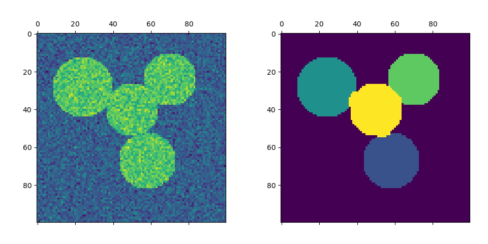

## Clustering

Clustering (also called *cluster analysis*) is a task of grouping similar instances into clusters. More formally, clustering is the task of grouping the population of **unlabeled data points** into clusters in a way that data points in the same cluster are more similar to each other than to data points in other clusters.

The clustering task is probably the most important in unsupervised learning, since it has many applications, for example:
- *data analysis*
- *anomaly detection*
- *semi-supervised learning*
- indirectly *clustering* tasks: recommender systems, search engines, etc., and
- directly *clustering* tasks: customer segmentation, image segmentation, etc.

At the same time, *Dimensionality Reduction* and *Anomaly Detection* tasks can be attributed to auxiliary ones (they are often interpreted as *data cleaning* or *feature engineering* tools). Despite the fact that these tasks are definitely important, some people often do not distinguish them separately when studying unsupervised learning, leaving only the clustering task. 

|  |
|:--:|
| <b>Clustering Algorithms by Scikit Learn. [Image Source](https://scikit-learn.org/0.15/auto_examples/cluster/plot_cluster_comparison.html)</b>|

All clustering algorithms **requires data preprocessing and standardization**. Most clustering algorithms perform worse with a large number of features, so it is sometimes recommended to use methods of *dimensionality reduction* before clustering.

### K-Means

K-Means algorithm is based on the *centroid* concept. *Centroid* is a geometric center (mean) of a cluster. First, centroids are initialized randomly (this is the basic option, but there are other initialization techniques). After that, we iteratively do the following, while centroids are moving:
- Assign data points a cluster number with the nearest centroid, and
- Move centroids - calculate the new mean value of the cluster elements.

|  |
|:--:|
| <b>Convergence of k-means algorithm. [Public Domain](https://en.wikipedia.org/wiki/K-means_clustering#/media/File:K-means_convergence.gif)</b>|

The strengths and weaknesses of the algorithm are intuitive. It is simple and fast, but it requires initial knowledge about the number of clusters, does not detect clusters of all shapes well, and can result in a local solution. To choose a good number of clusters we can use *sum of squared distances from data points to cluster centroids* as a metric and choose the number when this metric stops falling fast. To find a globally optimal solution, you can run the algorithm several times and choose the best result.

A speeded version of this algorithm is **Mini Batch K-Means**. In that case, we use a random subsample of the dataset instead of the whole dataset for calculations. There are a lot of other modifications, and many of them are implemented in *sklearn*.

**Pros**:
+ Simple and intuitive
+ Scales to large datasets
+ As a result, we also have centroids that can be used as standard cluster representatives
 
**Cons**:
- The number of clusters must be specified as a parameter
- Does not cope well with a very large number of features
- Separates only convex and homogeneous clusters well
- Can result in poor local solutions, so it needs to be run several times, choosing only the best solution (`n_init` parameter in *sklearn*)

### Hierarchical Clustering

Hierarchical clustering (also **Hierarchical Cluster Analysis (HCA)** or **Agglomerative Clustering**) is a family of clustering algorithms that build a hierarchy of clusters. 

It is represented as a dendrogram (a tree diagram). The *root* of the tree (upper element) is the only cluster that contains all data points. The *leaves* (bottom elements) are clusters, each of which contains only one data point. According to the generated dendrogram, you can choose the desired separation into any number of clusters.

|  |
|:--:|
| <b>Hierarchical Clustering Dendrogram Example. Image by Author, [code source](https://scikit-learn.org/stable/auto_examples/cluster/plot_agglomerative_dendrogram.html)</b>|

This family of algorithms requires calculating the distance between clusters. Different metrics are used for this purpose, but one of the most popular is **Ward distance**.

**Pros**:
+ Simple and intuitive
+ Works well when data has a hierarchical structure
  
**Cons**:
- The number of clusters must be specified as a parameter
- Separates only convex and homogeneous clusters well
- Greedy algorithm, so can result in poor local solutions

### Spectral Clustering

This algorithm takes a similarity matrix between the instances and creates a low-dimensional embedding from it (i.e., reduces its dimensionality), and then uses another clustering algorithm in this low-dimensional space (*sklearn* implementation uses K-Means).

|  |
|:--:|
| <b>Spectral Clustering for image segmentation by Scikit Learn. [Image Source](https://scikit-learn.org/stable/auto_examples/cluster/plot_segmentation_toy.html)</b>|

Spectral clustering can capture complex cluster structures and it can also be used to cut graphs (e.g. to identify clusters of friends on a social network).

Pros:
+ Can capture complex cluster structures
+ Can also be used to cut graphs
  
Cons:
- Doesn't scale well large numbers of instances
- Doesn't behave well when the clusters have very different sizes

### DBSCAN

DBSCAN stands for *Density-Based Spatial Clustering of Applications with Noise*.

The DBSCAN algorithm views clusters as areas of high density separated by areas of low density.
The central component to the DBSCAN is the concept of *core samples*, which are samples that are in areas of high density. A cluster is therefore a set of core samples, each close to each other and a set of non-core samples that are close to a core sample. Other samples are defined as outliers (or anomalies).

An extension or generalization of the DBSCAN algorithm is the **OPTICS** algorithm (*Ordering Points To Identify the Clustering Structure*).

**Pros**:
+ You don't need to specify the number of clusters
+ Solves the anomaly detection task at the same time
 
**Cons**:
- Need to select the density parameter
- Does not cope well with a sparse data

### Affinity Propagation

Affinity Propagation creates clusters by sending messages between pairs of samples until convergence. A dataset is then described using a small number of examples (standard representatives), which are identified as those most representative of other samples.

|  |
|:--:|
| <b>Affinity Propagation Clustering by Scikit Learn. [Image Source](https://scikit-learn.org/stable/auto_examples/cluster/plot_affinity_propagation.html)</b>|

Unfortunately, this algorithm has a computational complexity of O(m^2), so it too is not suited for large datasets.

**Pros**:
+ You don't need to specify the number of clusters
+ As a result of the algorithm we have standard representatives of a cluster. Unlike K-Means, these representatives are not just mean values, but real objects from the train set.
 
**Cons**:
- Computational complexity of O(m^2), so it too is not suited for large datasets
- Separates only convex and homogeneous clusters well
- Usually works worse than other algorithms

### Mean Shift

This algorithm starts by placing a circle centered on each instance, then for each circle it computes the mean of all the instances located within it, and it shifts the circle so that it is centered on the mean. Next, it iterates this mean-shifting step until all the circles stop moving.

Mean Shift shifts the circles in the direction of higher density, until each of them has found a local density minimum. Finally, all the instances whose circles have settled in the same place (or close enough) are assigned to the same cluster. Mean Shift has some of the features of DBSCAN, because it's based on density too.

**Pros**:
+ You don't need to specify the number of clusters
+ Have just one hyperparameter - the radius of the circles, called *bandwidth*
 
**Cons**:
- Does not cope well with a sparse data
- Tends to chop clusters into pieces when they have internal density variations
- Computational complexity of O(m^2), so it too is not suited for large datasets

### BIRCH

The BIRCH stands for *Balanced Iterative Reducing and Clustering using Hierarchies*. This algorithm was designed specifically for very large datasets, and it can be faster than batch K-Means, with similar results, as long as the number of features is not too large (<20). During training, it builds a tree structure containing just enough information to quickly assign each new instance to a cluster, without having to store all the instances in the tree: this approach allows it to use limited memory, while handling huge datasets.

**Pros**:
+ Was designed specifically for very large datasets when number of features is not too large (<20)
+ Allows it to use limited memory, while handling huge datasets

**Cons**:
- The number of clusters must be specified
- Does not cope well with a high-dimensional data

### Gaussian Mixture Models

Gaussian Mixture Models (*GMM*) is a probabilistic model that can solve both *Clustering* and *Anomaly detection*/*Density Estimation* unsupervised learning tasks.

This method relies on the *Expectation Maximization (EM)* algorithm and assumes that the data instances were generated from a mixture of several Gaussian distributions whose parameters are unknown.

|  |
|:--:|
| <b>Density Estimation with GMM by Scikit Learn. [Image Source](https://scikit-learn.org/stable/auto_examples/mixture/plot_gmm_pdf.html)</b>|

To choose a good number of clusters we can use *BIC* (Bayesian information criterion) or *AIC* (Akaike information criterion) and choose the model with minimum value. On the other hand, **Bayesian GMM** can be used - this model can detect the number of clusters itself and requires only a value that is greater than the optimal number of clusters.

The Gaussian Mixture Model is a *generative model*, meaning you can sample new instances from it. It is also possible to estimate the density of the model at any given location.

Pros:
+ Perfectly deals with data instances that were generated from a mixture of Gaussian distributions with different shapes and sizes
+ At the same time solves *density estimation* task
+ Is a *generative model*
 
Cons:
- The number of clusters must be specified (not in case of *Bayesian GMM*)
- *Expectation Maximization* algorithm can end up covering to poor solutions, so it needs to be run several times, keeping only the best solution (`n_init` parameter in *sklearn*)
- Does not scale well large numbers of features
- Assume that data instances were generated from a mixture of Gaussian distributions, so cope bad with data of other shape

### How to choose a clustering algorithm?

As you can see, clustering task is quite difficult and have a wide variety of applications, so it's almost impossible to build some universal set of rules to select a clustering algorithm - all of them have advantages and disadvantages.

Things become better when you have some assumptions about your data, so *data analysis* can help you with that. What is the approximate number of clusters? Are they located far from each other or do they intersect? Are they similar in shape and density? All that information can help you to solve your task better.

If the number of clusters is unknown, a good initial approximation is *the square root of the number of objects*. You can also first run an algorithm that does not require a number of clusters (*DBSCAN* or *Affinity Propagation*) and start from this number.

But the most important question remains the evaluation of quality - you can try all the algorithms, but how to understand which one is the best? There are a great many metrics for this - from *homogeneity* and *completeness* to *silhouette* - they show themselves differently in different tasks.
